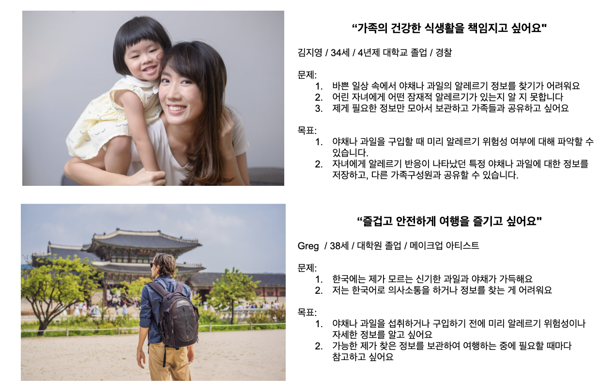
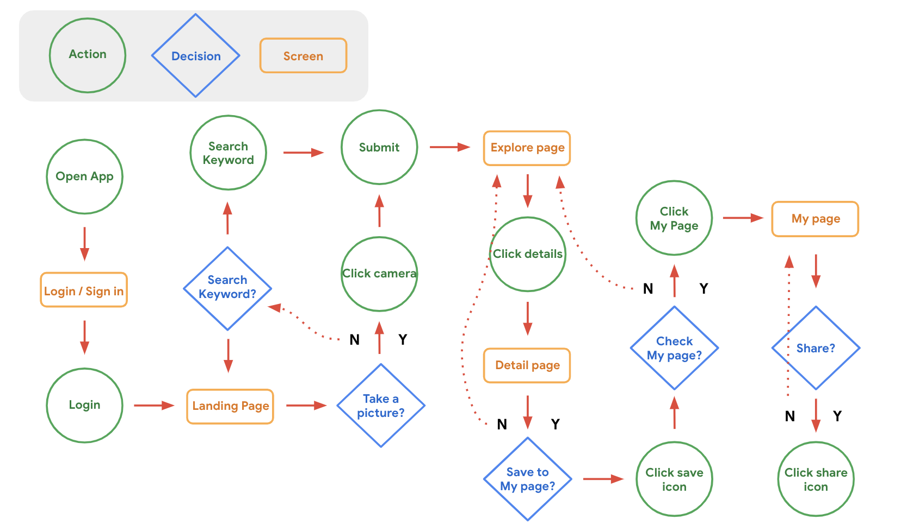
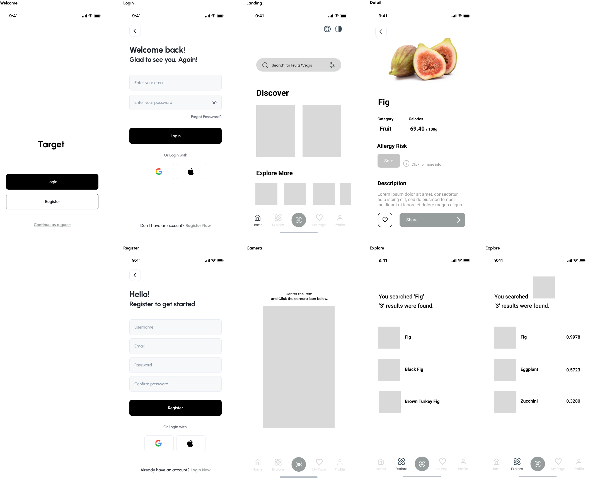
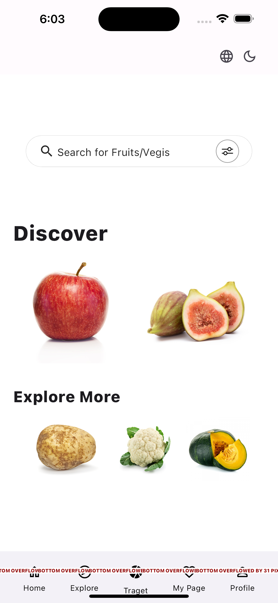

## Target

### Creator: **Yeon Kim**

### Index

1. Overview and Goals 
2. User analytics  
3. UI/UX Design  
4. Screen composition and functions  
5. UX Design   
6. Basic features of the App  
7. Testing and Debugging Strategies  
8. Development schedule and plan  
9. Resources and Tools  
10. 참고 자료  
Demo Screen  

### **1. Overview and Goals**

본 프로젝트는 과일과 채소의 종류를 구분하여 이미지를 자동으로 분류하는 앱의 개발을 목표로 합니다. 딥러닝과 컴퓨터 비전 기술을 활용하여 사용자들이 사진을 업로드하면 앱이 자동으로 과일과 채소를 식별하고 분류할 수 있으며, 사용자는 필요한 정보를 저장하고 타인과 공유할 수 있습니다.

이 프로젝트의 목표는 사용자가 촬영한 과일과 채소의 이미지를 빠르고 정확하게 분류하여 사용자들에게 시각적 정보를 제공하는 것입니다. 사용자는 원하는 정보를 검색하여 필요한 정보를 제공받을 수 있습니다.

This project aims to develop an app that automatically classifies images by different types of fruits and vegetables. Using deep learning and computer vision technology, when users upload photos, the app can automatically identify and classify fruits and vegetables, and users can save the necessary information and share it with others.

The goal of this project is to provide visual information to users by quickly and accurately classifying images of fruits and vegetables taken by users. Users can search for the information they want and receive the information they need.

### **2. User analytics**

**Define user requirements**

* 빠르고 정확한 과일과 채소의 분류 및 인식 기능  
    Fast and accurate classification and recognition of fruits and vegetables  

* 사용자 친화적인 UI/UX 디자인  
    User-friendly UI/UX design

* 실시간 이미지 처리 및 분류 기능 제공  
    Provides real-time image processing and classification functions

**User group and characteristic analysis**

이 앱은 다양한 종류의 과일과 채소에 대한 정보를 필요로 하는 사람들에게 유용할 것이며, 사용하기 쉬운 인터페이스를 원합니다.  
This app will be useful for people who need information about different types of fruits and vegetables and want an easy-to-use interface.  

### **3. UI/UX Design**

**Early design concept**

간결하고 직관적인 사용자 경험을 제공하며, 이미지 업로드 및 분류된 결과를 사용자가 쉽게 확인할 수 있는 UI를 중점으로 설계합니다.  
It provides a concise and intuitive user experience, and focuses on designing a UI that allows users to easily check image uploads and classified results.  

**User flow**

### **4. Screen composition and functions**

**Design wireframe**

**Purpose and function of each screen**

* Welcome: The first screen you see when you turn on the app  
* Login: Login screen  
* Register: User registration screen  
* Landing: Home screen that appears after logging in (or user registration)  
* Camera: Screen where users take pictures of items and submit photos   
* Detail: A screen containing detailed information about the item as a result of the image data  
* Explore: Screen to check search results/results for submitted photos or the latest feed  

### **5. UX Design**

**UI that considers user behavior and interaction**

I design an intuitive and friendly UI so that users can easily upload images and check classified results. Photo upload buttons are clearly displayed, and sorted results are visually presented to the user by category. Additionally, for user convenience, the UI is designed considering easy interactions such as swipe and touch.

**Features to improve UX**

* 자동 완성 기능: 이미지 업로드 시 사용자가 입력하는 과일 또는 채소의 이름을 자동으로 완성하여 빠르고 쉽게 입력할 수 있도록 합니다.  
    Auto-complete feature: When uploading an image, the name of the fruit or vegetable you enter is automatically completed to make input quick and easy.  
* 분류 정확도 표시: 분류된 결과의 정확도를 백분율로 표시하여 사용자에게 신뢰할 수 있는 정보를 제공합니다.  
    Display classification accuracy: Provides users with reliable information by displaying the accuracy of classified results as a percentage.  
* 대체 텍스트(Alt Text) 제공: 이미지에 대한 간결하고 설명적인 대체 텍스트를 제공하여 스크린 리더가 이미지를 인식하고 음성으로 설명할 수 있도록 합니다.  
    Provide Alt Text: Provide concise, descriptive alt text for your image so screen readers can recognize it and describe it audibly.  
* 음성 지원 기능 구현: 음성 인식 기능을 통해 사용자가 이미지에 대한 설명을 음성으로 요청하고 앱이 해당 설명을 제공할 수 있도록 합니다.  
    Implement voice-enabled functionality: Speech recognition allows users to request a description of an image by speaking and your app can provide that description.  
* 사용자 피드백 수집: 사용자가 잘못된 분류를 발견할 경우, 피드백을 제공하고 해당 정보를 학습하여 모델을 지속적으로 개선합니다.  
    Gather user feedback: When users discover misclassifications, they provide feedback and learn from that information to continuously improve the model.

### **6. Basic features of the App**

**Detailed description of each function**

* 이미지 업로드 기능: 사용자가 앱 내부에 저장된 이미지 또는 카메라로 찍은 사진을 업로드할 수 있습니다.  
    Image upload function: Users can upload images saved inside the app or photos taken with the camera.  
* 이미지 분류 기능: 딥러닝 모델을 활용하여 업로드된 이미지를 분석하고, 과일 또는 채소로 분류합니다.  
    Image classification function: Utilizes deep learning models to analyze uploaded images and classify them as fruits or vegetables.  
* 분류 결과 출력 기능: 분류된 과일과 채소의 이미지와 해당 정보(이름, 특징 등)를 사용자에게 제공합니다.  
    Classification result output function: Provides images of classified fruits and vegetables and corresponding information (name, characteristics, etc.) to the user.  
* 결과 정보 저장 기능: 이미지를 분석하여 도출된 결과 또는 검색하여 찾은 정보를 My Page에 저장할 수 있습니다.  
    Result information saving function: You can save results derived from image analysis or information found through search to My Page.  
* 정보 공유 기능: 사용자가 공유하기를 원하는 음식물 정보를 타인의 모바일로 전송하여 공유할 수 있습니다.  
    Information sharing function: Users can share food information they wish to share by sending it to another person's mobile phone.  

**Data input/output flow**

사용자가 이미지를 업로드하면, 해당 이미지 데이터는 백엔드 서버로 전송됩니다. 서버에서는 딥러닝 알고리즘을 통해 이미지를 분석하고, 분류된 결과를 다시 사용자 디바이스로 반환합니다. 앱은 단순하고 직관적인 네비게이션 구조를 갖추어, 사용자가 이용하기 편리하도록 설계됩니다. 메인 화면에서 결과 화면으로의 네비게이션은 단계적이고 명확한 버튼을 통해 이루어집니다.  

When a user uploads an image, the image data is sent to the backend server. The server analyzes the image using a deep learning algorithm and returns the classified results back to the user device. The app has a simple and intuitive navigation structure and is designed to be convenient for users to use. Navigation from the main screen to the results screen is step-by-step and through clear buttons.  

### **7. Testing and Debugging Strategies**

**Describe how to test early prototypes**

* 모의 테스트: 초기 프로토타입을 이용하여 유사 환경에서의 사용자 경험을 테스트하고, 사용자의 피드백을 수집하여 개선합니다.  
    Mock testing: Use early prototypes to test the user experience in a similar environment and collect feedback from users to make improvements.  
* 유닛 테스트: 각 기능 및 모듈을 독립적으로 테스트하여 오류를 발견하고 수정합니다.  
    Unit testing: Test each function and module independently to find and fix errors.  

**Debugging and error correction strategies**

웹 콘텐츠 접근성 지침(WCAG)에 따라 이미지를 설명하는 방법과 사용자 경험을 향상시키는 기술적 요구 사항을 준수하도록 합니다. 이미지 데이터 및 접근성의 경우, 접근성을 고려한 테스트를 진행하여, 시각적 정보를 제공하는 이미지가 음성으로 명확하게 전달되는지 확인하고 보완합니다. 오류가 발생한 경우, 해당 이슈에 대한 자세한 로그를 수집하여 오류를 신속하게 해결합니다. 또한 사용자들의 피드백을 지속적으로 받아들여 모델 및 앱의 개선을 진행합니다.  

I will follow the Web Content Accessibility Guidelines (WCAG) to ensure that images are described in the app and adhere to technical requirements that improve the user experience. When it comes to image data and accessibility, I conduct accessibility testing to ensure that the visual information in the images is clearly communicated through audio. If an error occurs, I collect detailed logs about the issue and resolve the error quickly. Additionally, I continually receive feedback from users to improve the model and app.  

### **8. Development schedule and plan**

* 데이터 수집 및 준비 (1주): 데이터 수집, 이미지 라벨링 작업 및 데이터 전처리  
    Data collection and preparation (1 week): data collection, image labeling tasks, and data preprocessing  
* 딥러닝 모델 학습 및 모델 테스트 (2주): CNN 등 간단한 딥러닝 모델 설계 및 학습, 데이터 학습 및 모델 검증  
    Deep learning model training and model testing (2 weeks): Design and learn simple deep learning models such as CNN, data learning, and model verification  
* 앱 개발 (1주): 딥러닝 모델과 앱 연결, 사용자 인터페이스에 딥러닝 모델 적용  
    App development (1 week): Connecting deep learning model to app, applying deep learning model to user interface  
* 테스트, 디버깅 및 배포 (1주): 전체 앱의 테스트 및 버그 수정, 최종 사용자 테스트 진행, 앱 스토어 등록 및 배포 준비  
    Testing, Debugging, and Deployment (1 week): Test and fix bugs in the entire app, conduct end-user testing, and prepare it for app store listing and distribution.  
* 유지보수 및 모델 개선 (영원히): 사용자 피드백에 따른 모델 개선 및 업데이트  
    Maintenance and Model Improvements (Forever): Model improvements and updates based on user feedback.  

### **9. Resources and Tools**

**Human resources**  

**`Me`** as BIG Boss, PM, Developer, Designer, QA, Data Scientist.  

**Software and Libraries**  

Kaggle, Flutter, Dart, Firebase, etc.  

### **10. Reference**

* [Image Classification with flutter](https://medium.com/geekculture/image-classification-with-flutter-182368fea3b)
* [Fruits and Vegetables Image Recognition Dataset](https://www.kaggle.com/datasets/kritikseth/fruit-and-vegetable-image-recognition)
* [Web Content Accessibility Guidelines (WCAG) 2.1](https://www.w3.org/TR/WCAG21/#:~:text=Web%20Content%20Accessibility%20Guidelines%20(WCAG)%202.1%20defines%20how%20to%20make,%2C%20learning%2C%20and%20neurological%20disabilities.)

### Demo Screen

