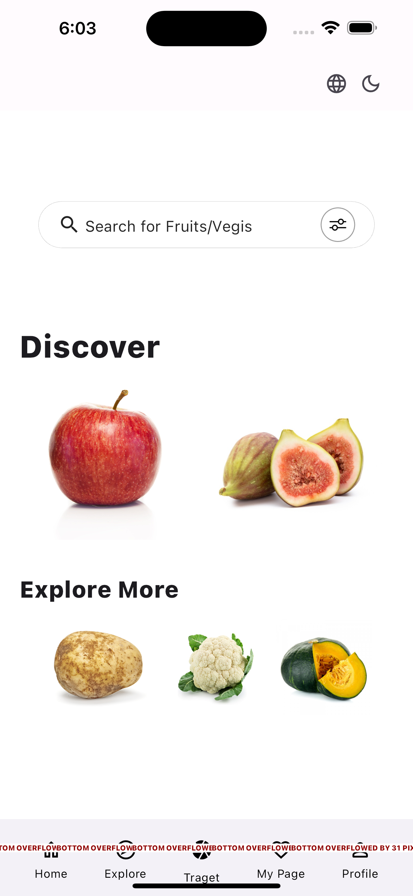

## target

**Creator: Yeon Kim**

**Index**

1. 개요 및 목표
2. 사용자 분석
3. UI/UX Design
4. 화면 구성 및 기능
5. 사용자 경험 설계
6. 앱의 기본 기능
7. 테스트 및 디버깅 전략
8. 개발 일정 및 계획
9. 리소스 및 도구
10. 참고 자료

Demo Screen
회고

### **1. 개요 및 목표**

본 프로젝트는 과일과 채소의 종류를 구분하여 이미지를 자동으로 분류하는 앱의 개발을 목표로 합니다. 딥러닝과 컴퓨터 비전 기술을 활용하여 사용자들이 사진을 업로드하면 앱이 자동으로 과일과 채소를 식별하고 분류할 수 있으며, 사용자는 필요한 정보를 저장하고 타인과 공유할 수 있습니다.

이 프로젝트의 목표는 사용자가 촬영한 과일과 채소의 이미지를 빠르고 정확하게 분류하여 사용자들에게 시각적 정보를 제공하는 것입니다. 사용자는 원하는 정보를 검색하여 필요한 정보를 제공받을 수 있습니다. 사진을 촬영하여 제출하거나 검색 기능을 통해 사용자가 식품 관련 정보를 쉽게 얻을 수 있도록 합니다.

### **2. 사용자 분석**

**사용자 요구사항 정의**

* 빠르고 정확한 과일과 채소의 분류 및 인식 기능
* 사용자 친화적인 UI/UX 디자인
* 실시간 이미지 처리 및 분류 기능 제공

**사용자 그룹 및 특성 분석**

이 앱은 다양한 종류의 과일과 채소에 대한 정보를 필요로 하는 사람들에게 유용할 것이며, 사용하기 쉬운 인터페이스를 원합니다.

### **3. UI/UX Design**

**초기 디자인 컨셉**

간결하고 직관적인 사용자 경험을 제공하며, 이미지 업로드 및 분류된 결과를 사용자가 쉽게 확인할 수 있는 UI를 중점으로 설계합니다.

**사용자 플로우**

### **4. 화면 구성 및 기능**

**디자인 와이어 프레임**

**각 화면의 목적과 기능**

* Welcome: 앱을 켜면 가장 먼저 보이는 화면  
* Login: 로그인 화면
* Register: 사용자 등록 화면  
* Landing: 로그인(또는 사용자 등록)을 마친 후 나타나는 홈 화면  
* Camera: 사용자가 아이템을 촬영 및 사진 제출을 하는 화면  
* Detail: 이미지 데이터에 대한 결과로서 아이템의 자세한 정보를 포함하는 화면  

### **5. 사용자 경험 설계**

**사용자의 행동 및 상호작용 고려한 UI**

사용자가 쉽게 이미지를 업로드하고 분류된 결과를 확인할 수 있도록 직관적이고 친숙한 UI를 설계합니다. 사진 업로드 버튼은 명확히 표시되며, 분류된 결과는 카테고리별로 구분하여 사용자에게 시각적으로 제공됩니다. 또한, 사용자의 편의성을 위해 스와이프, 터치 등의 간편한 상호작용을 고려하여 UI를 설계합니다.

**사용자 경험을 개선하기 위한 기능**

* 자동 완성 기능: 이미지 업로드 시 사용자가 입력하는 과일 또는 채소의 이름을 자동으로 완성하여 빠르고 쉽게 입력할 수 있도록 합니다.
* 분류 정확도 표시: 분류된 결과의 정확도를 백분율로 표시하여 사용자에게 신뢰할 수 있는 정보를 제공합니다.
* 사용자 피드백 수집: 사용자가 잘못된 분류를 발견할 경우, 피드백을 제공하고 해당 정보를 학습하여 모델을 지속적으로 개선합니다.
* 대체 텍스트(Alt Text) 제공: 이미지에 대한 간결하고 설명적인 대체 텍스트를 제공하여 스크린 리더가 이미지를 인식하고 음성으로 설명할 수 있도록 합니다.
* 음성 지원 기능 구현: 음성 인식 기능을 통해 사용자가 이미지에 대한 설명을 음성으로 요청하고 앱이 해당 설명을 제공할 수 있도록 합니다.

### **6. 앱의 기본 기능**

**각 기능에 대한 상세한 설명**

* 이미지 업로드 기능: 사용자가 앱 내부에 저장된 이미지 또는 카메라로 찍은 사진을 업로드할 수 있습니다.
* 이미지 분류 기능: 딥러닝 모델을 활용하여 업로드된 이미지를 분석하고, 과일 또는 채소로 분류합니다.
* 분류 결과 출력 기능: 분류된 과일과 채소의 이미지와 해당 정보(이름, 특징 등)를 사용자에게 제공합니다.
* 결과 정보 저장: 이미지를 분석하여 도출된 결과 또는 검색하여 찾은 정보를 My Page에 저장할 수 있습니다.
* 정보 공유 기능: 사용자가 공유하기를 원하는 음식물 정보를 타인의 모바일로 전송하여 공유할 수 있습니다.

**데이터 입력/출력의 흐름**

사용자가 이미지를 업로드하면, 해당 이미지 데이터는 백엔드 서버로 전송됩니다. 서버에서는 딥러닝 알고리즘을 통해 이미지를 분석하고, 분류된 결과를 다시 사용자 디바이스로 반환합니다. 앱은 단순하고 직관적인 네비게이션 구조를 갖추어, 사용자가 이용하기 편리하도록 설계됩니다. 메인 화면에서 결과 화면으로의 네비게이션은 단계적이고 명확한 버튼을 통해 이루어집니다.

### **7. 테스트 및 디버깅 전략**

**초기 프로토타입 테스트 방법 설명**

* 모의 테스트: 초기 프로토타입을 이용하여 유사 환경에서의 사용자 경험을 테스트하고, 사용자의 피드백을 수집하여 개선합니다.
* 유닛 테스트: 각 기능 및 모듈을 독립적으로 테스트하여 오류를 발견하고 수정합니다.

**디버깅 및 오류 수정 전략**

웹 콘텐츠 접근성 지침(WCAG)에 따라 이미지를 설명하는 방법과 사용자 경험을 향상시키는 기술적 요구 사항을 준수하도록 합니다. 이미지 데이터 및 접근성의 경우, 접근성을 고려한 테스트를 진행하여, 시각적 정보를 제공하는 이미지가 음성으로 명확하게 전달되는지 확인하고 보완합니다. 오류가 발생한 경우, 해당 이슈에 대한 자세한 로그를 수집하여 오류를 신속하게 해결합니다. 또한 사용자들의 피드백을 지속적으로 받아들여 모델 및 앱의 개선을 진행합니다.

### **8. 개발 일정 및 계획**

* 데이터 수집 및 준비 (1주): 데이터 수집, 이미지 라벨링 작업 및 데이터 전처리
* 딥러닝 모델 학습 및 모델 테스트 (2주): CNN 등 간단한 딥러닝 모델 설계 및 학습, 데이터 학습 및 모델 검증
* 앱 개발 (1주): 딥러닝 모델과 앱 연결, 사용자 인터페이스에 딥러닝 모델 적용 
* 테스트, 디버깅 및 배포 (1주): 전체 앱의 테스트 및 버그 수정, 최종 사용자 테스트 진행, 앱 스토어 등록 및 배포 준비
* 유지보수 및 모델 개선 (영원히): 사용자 피드백에 따른 모델 개선 및 업데이트

### **9. 리소스 및 도구**

**인적 자원**  

**Me** as BIG Boss, PM, Developer, Designer, QA, Data Scientist.  

**소프트웨어 및 라이브러리**  

Kaggle, Flutter, Dart, Firebase, ect.  

### **10. 참고 자료**

* [Image Classification with flutter](https://medium.com/geekculture/image-classification-with-flutter-182368fea3b)
* [Fruits and Vegetables Image Recognition Dataset](https://www.kaggle.com/datasets/kritikseth/fruit-and-vegetable-image-recognition)
* [Web Content Accessibility Guidelines (WCAG) 2.1](https://www.w3.org/TR/WCAG21/#:~:text=Web%20Content%20Accessibility%20Guidelines%20(WCAG)%202.1%20defines%20how%20to%20make,%2C%20learning%2C%20and%20neurological%20disabilities.)

### Demo Screen

### Retrospect

> 여러가지 작업을 동시에 진행하다보니 매우 분주했습니다만 이번 기회를 통해 어떤 프로젝트를 진행하면 좋을지 그리고 어떻게 접근해야 하는지 생각하는 기회를 가질 수 있었습니다. 다양한 사용자가 쉽게 이용할 수 있는 앱이 되도록 화면 구성을 단순화하고 직관적으로 이해되는 아이콘을 선정해야할 필요를 느낍니다. 또한 실제 학습된 모델을 앱과 연결하여 UI를 적용할 때 어떤 식으로 표현해야 적절한지에 대해 더 고민해봐야 겠습니다. 